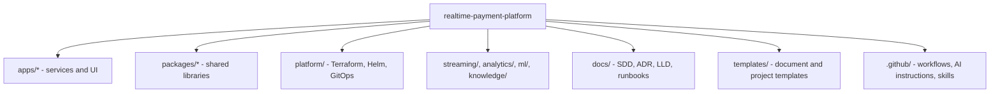
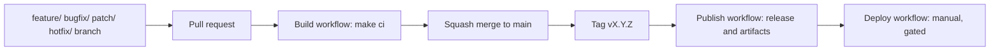

# Repository overview

How the monorepo is organized and how a change travels from branch to release.

## Layout

```mermaid
flowchart TB
  root[realtime-payment-platform]
  root --> apps[apps/* - services and UI]
  root --> packages[packages/* - shared libraries]
  root --> platform[platform/ - Terraform, Helm, GitOps]
  root --> streaming[streaming/, analytics/, ml/, knowledge/]
  root --> docs[docs/ - SDD, ADR, LLD, runbooks]
  root --> templates[templates/ - document and project templates]
  root --> github[.github/ - workflows, AI instructions, skills]
```

## Delivery flow

```mermaid
flowchart LR
  B[feature/ bugfix/ patch/ hotfix/ branch] --> PR[Pull request]
  PR --> Build[Build workflow: make ci]
  Build --> Merge[Squash merge to main]
  Merge --> Tag[Tag vX.Y.Z]
  Tag --> Publish[Publish workflow: release and artifacts]
  Publish --> Deploy[Deploy workflow: manual, gated]
```
