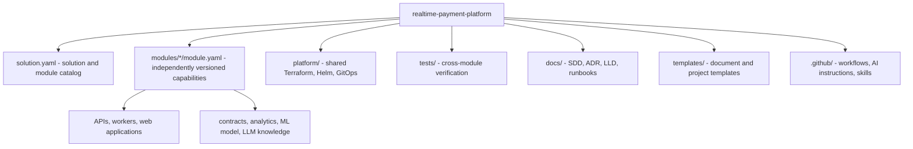
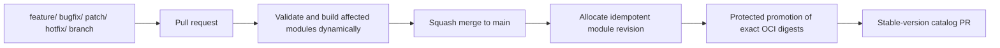

# Repository and delivery overview

How the monorepo's independently versioned modules are cataloged and how changes travel from branch to release.

## Layout

```mermaid
flowchart TB
  root[realtime-payment-platform]
  root --> catalog[solution.yaml - solution and module catalog]
  root --> modules[modules/*/module.yaml - independently versioned capabilities]
  modules --> apps[APIs, workers, web applications]
  modules --> data[contracts, analytics, ML model, LLM knowledge]
  root --> platform[platform/ - shared Terraform, Helm, GitOps]
  root --> tests[tests/ - cross-module verification]
  root --> docs[docs/ - SDD, ADR, LLD, runbooks]
  root --> templates[templates/ - document and project templates]
  root --> github[.github/ - workflows, AI instructions, skills]
```

## Delivery flow

```mermaid
flowchart LR
  B[feature/ bugfix/ patch/ hotfix/ branch] --> PR[Pull request]
  PR --> Build[Validate and build affected modules dynamically]
  Build --> Merge[Squash merge to main]
  Merge --> Revision[Allocate idempotent module revision]
  Revision --> Promote[Protected promotion of exact OCI digests]
  Promote --> Stable[Stable-version catalog PR]
```
