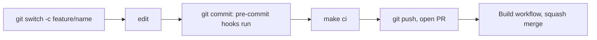

# Developer setup

How to prepare a machine to work on this repository. Target environment: Windows with WSL2 (Ubuntu), VS Code Remote - WSL. Native Linux and macOS work the same way.

Work inside the WSL filesystem (for example `~/code`), not under `/mnt/c`, for speed and correct line endings.

## 1. Prerequisites

| Tool | Needed for | Install (Ubuntu/WSL) |
|---|---|---|
| git | Version control | `sudo apt install git` |
| make | All workflows | `sudo apt install make` |
| python3 with venv | pre-commit | `sudo apt install python3 python3-venv` |
| SSH key on GitHub | Push access | [GitHub docs](https://docs.github.com/en/authentication/connecting-to-github-with-ssh); verify with `ssh -T git@github.com` |
| GitHub CLI (optional) | Creating pull requests | [cli.github.com](https://cli.github.com); then `gh auth login` |

Later stages add Docker, Minikube, kubectl, Helm, Terraform, Go, and Node.js. They are documented here and checked by `make doctor` when the stage that needs them is delivered.

## 2. One-time setup

```bash
git clone git@github.com:varunpathania86/realtime-payment-platform.git
cd realtime-payment-platform
make setup
```

`make setup`:

1. Installs `pre-commit` into the git-ignored `.venv/` (skipped if `pre-commit` is already on your PATH).
2. Installs the git pre-commit hook, so checks run on every commit.
3. Runs `make doctor` and reports any missing tool.

## 3. Daily commands

| Command | Purpose |
|---|---|
| `make help` | List all targets |
| `make doctor` | Check required tools |
| `make ci` | Lint, test, and build; same as the Build workflow |
| `make lint` | Shared static checks and per-project lint |
| `make fmt` | Format all sub-projects |
| `make projects` | List discovered sub-projects |

## 4. Workflow summary



Branch, commit, and versioning rules are in [CONTRIBUTING.md](../CONTRIBUTING.md).

## 5. Troubleshooting

| Problem | Fix |
|---|---|
| `make doctor` reports `MISSING pre-commit` | Run `make setup` |
| `python3 -m venv` fails | `sudo apt install python3-venv` |
| `Permission denied (publickey)` on push | Check the key with `ssh -T git@github.com` and that the remote uses the SSH URL (`git remote -v`) |
| Hooks fail on line endings | Work in the WSL filesystem; the repo enforces LF via `.gitattributes` |
| Hook environments are broken or stale | `.venv/bin/pre-commit clean` (or `pre-commit clean`), then `make lint` |
