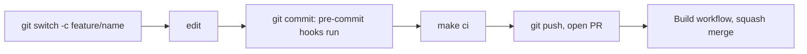

# Developer setup

How to prepare a machine to work on this repository. Target environment: Windows with WSL2 (Ubuntu), VS Code Remote - WSL. Native Linux and macOS work the same way.

Work inside the WSL filesystem (for example `~/code`), not under `/mnt/c`, for speed and correct line endings.

## 1. Prerequisites

| Tool | Needed for | Install (Ubuntu/WSL) |
|---|---|---|
| git | Version control | `sudo apt install git` |
| make | All workflows | `sudo apt install make` |
| python3 with venv | pre-commit | `sudo apt install python3 python3-venv` |
| SSH key on GitHub | Push access | [GitHub docs](https://docs.github.com/en/authentication/connecting-to-github-with-ssh); verify with `ssh -T git@github.com` |
| GitHub CLI (optional) | Creating pull requests | [cli.github.com](https://cli.github.com); then `gh auth login` |

`make setup` installs the pinned tools and Docker (see below). Node.js is only checked.

### Pinned tools

Versions are pinned in [.tool-versions](../.tool-versions). `make setup` (or `make tools`) downloads kubectl, Minikube, Helm, Terraform, Go, jq, and yq into `~/.local/bin` without sudo, verifying each download with SHA-256. Go is unpacked to `~/.local/go`. Tools already at the pinned version are skipped, so the command is safe to repeat.

Make sure `~/.local/bin` is on your PATH:

```bash
echo 'export PATH="$HOME/.local/bin:$PATH"' >> ~/.bashrc && source ~/.bashrc
```

To upgrade a tool, change its version in `.tool-versions` and run `make tools`.

### Docker

Minikube runs on the Docker driver. `make setup` runs `scripts/install-docker.sh` (also available alone as `make docker`):

- If `docker info` already works (Docker Desktop with WSL integration, or an existing Engine), nothing is installed.
- Otherwise it installs Docker Engine from Docker's official apt repository, enables the service, and adds you to the `docker` group. This needs `sudo`, so it asks for your password once. Supported: Ubuntu and Debian, including WSL2 with systemd.
- Docker then works without `sudo`. Group changes normally apply only to new shells, so the `make` targets (`make setup`, `make doctor`, `make cluster-*`) re-run themselves under the `docker` group and work immediately. For plain `docker` commands in an already-open terminal, run `newgrp docker`, or open a new terminal (in WSL: `wsl --shutdown` from Windows PowerShell, then reopen).

On other systems, install Docker manually ([Docker Desktop](https://docs.docker.com/desktop/) or [Engine](https://docs.docker.com/engine/install/)) and verify with `docker info`.

### Node.js

Node.js 22 is required for the React portal (pnpm or npm). Install it with your preferred manager, for example [nvm](https://github.com/nvm-sh/nvm): `nvm install 22`.

## 2. One-time setup

```bash
git clone git@github.com:varunpathania86/realtime-payment-platform.git
cd realtime-payment-platform
make setup
```

`make setup`:

1. Installs `pre-commit` into the git-ignored `.venv/` (skipped if `pre-commit` is already on your PATH).
2. Installs the git pre-commit hook, so checks run on every commit.
3. Installs the pinned tools from `.tool-versions` (`scripts/install-tools.sh`).
4. Installs Docker Engine if it is missing (`scripts/install-docker.sh`, needs sudo).
5. Runs `make doctor`, which compares everything with `.tool-versions` and lists problems (for example a missing Docker).

## 3. Daily commands

| Command | Purpose |
|---|---|
| `make help` | List all targets |
| `make doctor` | Check the environment against `.tool-versions` |
| `make tools` | Install or update the pinned tools |
| `make docker` | Install Docker Engine if missing (needs sudo) |
| `make cluster-up` | Start the local Minikube cluster (profile `rpp`) |
| `make cluster-status` | Show cluster status |
| `make cluster-down` | Delete the cluster and its data (destructive) |
| `make ci` | Lint, test, and build; same as the Build workflow |
| `make lint` | Shared static checks and per-project lint |
| `make fmt` | Format all sub-projects |
| `make projects` | List discovered sub-projects |

## 4. Workflow summary



Branch, commit, and versioning rules are in [CONTRIBUTING.md](../CONTRIBUTING.md).

## 5. Troubleshooting

For WSL networking and disk problems see the [WSL runbook](runbooks/wsl-troubleshooting.md).

| Problem | Fix |
|---|---|
| `make doctor` reports `PROBLEM ...` | Follow the hint printed on that line; most are fixed by `make setup` |
| `~/.local/bin is not on PATH` | Add it to `~/.bashrc` as shown above |
| `docker daemon is not reachable` | `sudo systemctl start docker`, or start Docker Desktop with WSL integration |
| `permission denied` on the Docker socket | Run `newgrp docker` or open a new terminal so the `docker` group applies; `make` targets work without this |
| `python3 -m venv` fails | `sudo apt install python3-venv` |
| `Permission denied (publickey)` on push | Check the key with `ssh -T git@github.com` and that the remote uses the SSH URL (`git remote -v`) |
| Hooks fail on line endings | Work in the WSL filesystem; the repo enforces LF via `.gitattributes` |
| Hook environments are broken or stale | `.venv/bin/pre-commit clean` (or `pre-commit clean`), then `make lint` |
