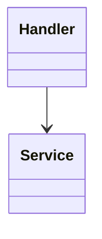
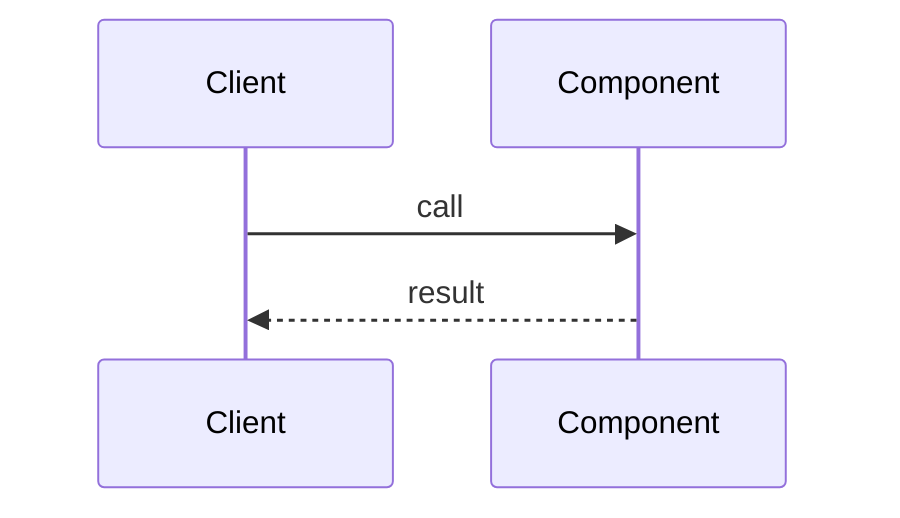

# LLD: Component Name

- **Status:** Draft | Review | Approved
- **Parent SDD:** link
- **Owner:** name

## 1. Responsibility

## 2. Structure

## 3. Interfaces

APIs, events, and function contracts (link to OpenAPI/Avro files).

## 4. Data and state

## 5. Behavior

## 6. Error handling and idempotency

## 7. Configuration

## 8. Tests

Unit, integration, and contract tests for this component.

## 9. Open questions
