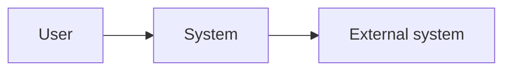
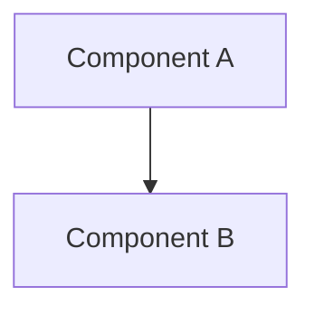
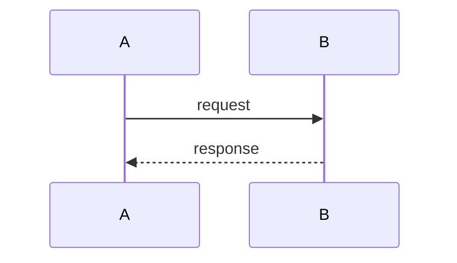

# SDD: System or Project Name

- **Status:** Draft | Review | Approved
- **Version:** v0.0.0
- **Owner:** name

## 1. Purpose and scope

## 2. Requirements

### 2.1 Functional

### 2.2 Non-functional (performance, security, availability, cost)

## 3. Context diagram

## 4. Architecture

Container/component diagram and responsibilities.

## 5. Data model and contracts

## 6. Key flows

## 7. Security and privacy

## 8. Observability

## 9. Testing strategy

## 10. Deployment and operations

## 11. Risks and open questions

## 12. Related ADRs and LLDs
